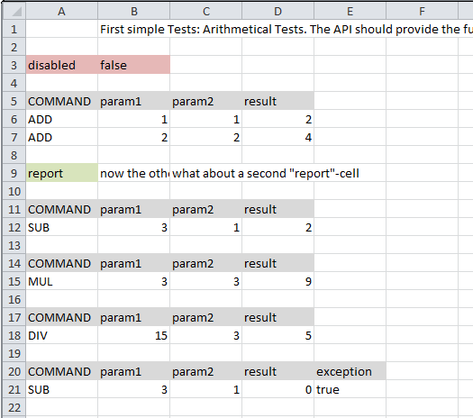

jexunit
=======

> a Tool for defining JUnit-Tests in Excel Worksheets

**JExUnit** is a framework for **"command based testing"** based on the JUnit framework.
It provides simple mechanisms to define your own commands. The test-data will be defined in Excel-files where each sheet or optionally each "*command*" (row) will be executed as a test-case (in JUnit).

## First steps ##

To use the JExUnit framework you have to do only three steps:

1. Create a test class annotated with
    
        @RunWith(JExUnit.class)

2. Add an attribute of type String, String[] or List<String> (or a static method returning one of these types) representing the excel-file(s) to "execute", annotated with

        @ExcelFile

3. Define/Implement your commands. A command will be a "simple" Method annotated with

        @TestCommand

Now you can write your tests in excel-sheets. If you run your test class as JUnit-Test, the JExUnit-framework will automatically load the excel-file(s), "find" and run the commands (in the same order as they are defined in the excel-file(s)).

###### Simple example ######

    @RunWith(JExUnit.class)
    public class ArithmeticalTest {

        private static Logger log = Logger.getLogger(ArithmeticalTest.class.getName());

	    @ExcelFile
	    static String[] excelFiles = new String[] { "src/test/resources/ArithmeticalTests.xlsx",
			"src/test/resources/ArithmeticalTests2.xlsx" };

	    @TestCommand(value = "mul")
	    public static void runMulCommand(TestCase testCase, ArithmeticalTestObject testObject) throws Exception {
		    log.log(Level.INFO, "in test command: MUL!");
	 	    assertThat(testObject.getParam1() * testObject.getParam2(), equalTo(testObject.getResult()));
	    }

	    @TestCommand(value = "div")
	    public static void runDivCommand(TestCase testCase, ArithmeticalTestObject testObject) throws Exception {
		    log.log(Level.INFO, "in test command: DIV!");
		    assertThat(testObject.getParam1() / testObject.getParam2(), equalTo(testObject.getResult()));
	    }
    }

---

#### @ExcelFile

  The _@ExcelFile_-Annotation is used to define the excel-file(s) to run as test(s). This can be defined by a static attribute or a static method (without parameters). The return type of the method (and the type of the attribute) has to be _String_, _String[]_ or _List&lt;String>_.

  Per default the JExUnit-framework will run one excel-worksheet as a single test (like one testcase in JUnit). If you are going to run each command in the file as single test (like multiple testcases/-methods in JUnit), there is a flag available for the _@ExcelFile_-Annotation: _worksheetAsTest_. If this is set to false (default value is true), the framework will run each command as a single test!

      @ExcelFile(worksheetAsTest = false)
	  public static String[] getExcelFiles() {
		  String[] excelFiles = new String[] { "src/test/resources/MassTests.xlsx",
				"src/test/resources/MassTests2.xlsx" };
		  return excelFiles;
	  }

#### @TestCommand

  The _@TestCommand_-Annotation is the connector between your business logic and the JExUnit-framework. A test command is a method annotated with _@TestCommand_. There are multiple possibilities to define this method. First of all, it doesn't matter if the method is static or not. The framework will call the static methods as well as the non-static ones.

  You are mostly allowed defining the methods parameters. The JExUnit-framework will try to "inject" you the correct data. The possible parameters are the following:

  - TestCase: this is the (internal) representation of a testcase. You are allowed to use this type as parameter in your command method.
  - &lt;you-own-entity&gt;: if you want the framework to create an instance of your business entity out of the parameters in your excel-file, just define your entity as a parameter in your command method. It should also be possible to get multiple entities here (but of different types!).
  - primitive type annotated with @TestParam: this will get a parameter directly out of the excel-file (but type-safe). The parameter will be looked up either by the parameters name or the id set to the Annotation (e.g. @TestParam("id")).
  - TestContext: this is the (current) TestContext where you can put (and get) things you want. The TestContext lives as long as your test so you can share data between multiple test commands.
  - @Context &lt;your-own-entity&gt;: you get the current instance of the given type out of the TestContext. If you want to put multiple instances of the same type into the TestContext you can do this by setting an id. If so, you can get the instance out of the TestContext by id with @Context("&lt;your-id&gt;").

## The Excel-File ##

  Test(s) will be defined in excel-file(s). Per default, each worksheet will be executed as a single test.

  For creating the excel-file(s) there are some things to notice:

  The first column is reserved for the commands. There are some built-in commands you can use:

  - _disabled_: if set to true (the value of the next column) this will disable the current worksheet
  - _report_: this command will write the content of the following columns to the log file

  If you leave the first column blank, the rest of the row will be ignored, so you can use this "space" for comments inside your excel-file.

  The most important keyword is _COMMAND_. A row starting with the keyword _COMMAND_ will reset and redefine the current temporary headers, meaning all the following data-rows will be mapped to the keys defined in this row! This is made for calling the same command multiple times (with different parameters) without (re-)defining the keys.

  The _COMMAND_ keyword has to be place in the first column! The other columns in this row will define the keys for mapping the values. For example your keys could be the attributes names of your entities to map the values of the following row to, so you can implement your commands type-safe and use your entites here.

  The row(s) after the "command definition" will "call" the commands.

  Regardless of the keys used for your commands, there is the _exception_ keyword. If this parameter is set to _true_, the execution of the command will expect an exception (like @Test(expected = Exception.class) in JUnit) and will fail if there is no exception thrown!

  All the built-in commands and keywords are case-insensitive.

##### Example excel-file #####

  

  This short and very simple example shows the way defining the tests.
  
  The first and second row will be ignored because the first column is left blank. So this is used for a comment (in this case this will describe what the test is used for).

  Cell A3 defines the built-in command to disable a worksheet. The value is set in cell B3.

  Row 5 is the first command-definition: the keyword COMMAND in cell A5 defines the "new" header-row where the keys are defined. So the next 2 rows (6 and 7) wil "call" the command "ADD" (this is a user-defined command for the test!). The values '1', '1' and '2' and '2', '2' and '4' will be mapped to 'param1', 'param2' and 'param3'.

  Cell A9 is another built-in command to log the data of the following cells of row 9.

  The lines 11 - 19 work the same way as the columns 5 - 7.

  In line 20 there is an exapmle for the built-in keyword _exception_. As you can see, the command named "SUB" will subtract 'param2' from 'param1' and check the 'result', which should fail (3-1 != 0). To get "a green bar" for this test, an AssertionError should be expected. The parameter 'exception' with value set to _true_ will arrange this behaviour.

## The Test-Commands ##

TODO

## The TestContext ##

TODO