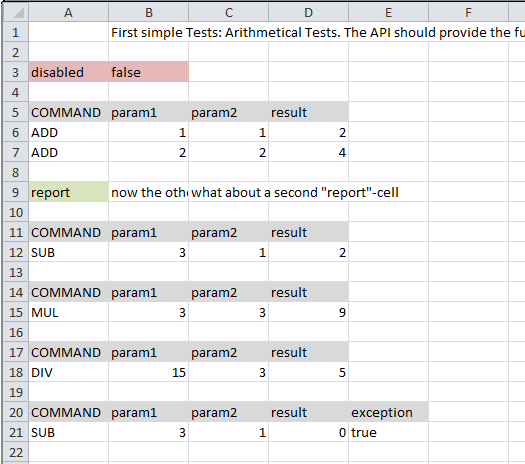

jexunit
=======

[](https://jitpack.io/#fhm84/jexunit)

> A tool for defining JUnit tests in Excel worksheets

**JExUnit** is a JUnit-based framework for **command-based testing**.
It provides simple mechanisms for defining your own commands. Test data is defined in Excel files, where each worksheet — or optionally each individual command row — is executed as a separate test case in JUnit.


## First steps ##

To use JExUnit you only need three steps:

1. Create a test class annotated with
    
        @RunWith(JExUnit.class)

2. Add a field of type `String`, `String[]`, or `List<String>` (or a static method returning one of these types) that points to the Excel file(s) to run, annotated with

        @ExcelFile

3. Implement your commands. A command is any method annotated with

        @TestCommand


Now you can write your tests in Excel sheets. When you run your test class as a JUnit test, JExUnit will automatically load the Excel file(s), find the matching command methods, and run them in the order they appear in the file.

###### Simple example ######

    @RunWith(JExUnit.class)
    public class ArithmeticalTest {

        private static Logger log = Logger.getLogger(ArithmeticalTest.class.getName());

	    @ExcelFile
	    static String[] excelFiles = new String[] { "src/test/resources/ArithmeticalTests.xlsx",
			"src/test/resources/ArithmeticalTests2.xlsx" };

	    @TestCommand(value = "mul")
	    public static void runMulCommand(TestCase testCase, ArithmeticalTestObject testObject) throws Exception {
		    log.log(Level.INFO, "in test command: MUL!");
	 	    assertThat(testObject.getParam1() * testObject.getParam2(), equalTo(testObject.getResult()));
	    }

	    @TestCommand(value = "div")
	    public static void runDivCommand(TestCase testCase, ArithmeticalTestObject testObject) throws Exception {
		    log.log(Level.INFO, "in test command: DIV!");
		    assertThat(testObject.getParam1() / testObject.getParam2(), equalTo(testObject.getResult()));
	    }
    }

---

#### @ExcelFile

  The `@ExcelFile` annotation defines the Excel file(s) to run as tests. It can be placed on a static field or a static method (without parameters). The type must be `String`, `String[]`, or `List<String>`.

  By default, JExUnit runs one Excel worksheet as a single test (like a single test case in JUnit). To run each command row as its own test (like individual test methods in JUnit), use the `worksheetAsTest` flag on the annotation. When set to `false` (the default is `true`), the framework runs each command as a separate test.

      @ExcelFile(worksheetAsTest = false)
	  public static String[] getExcelFiles() {
		  String[] excelFiles = new String[] { "src/test/resources/MassTests.xlsx",
				"src/test/resources/MassTests2.xlsx" };
		  return excelFiles;
	  }


#### @TestCommand

  The `@TestCommand` annotation is the connection between your business logic and JExUnit. A test command is any method annotated with `@TestCommand`. The method can be static or non-static — the framework handles both.

  You have full control over the method's parameters. JExUnit will inject the appropriate values automatically. The supported parameter types are:

  - `TestCase`: the internal representation of the current test row. Gives access to all cell values and test flags.
  - `<YourEntity>`: declare your own class as a parameter and JExUnit will create an instance and populate it from the column values in the Excel row. Multiple entity types are supported, as long as each type appears only once.
  - Primitive type annotated with `@TestParam`: retrieves a single column value from the Excel row with automatic type conversion. The column is looked up by the parameter's name or by the id given to the annotation (e.g. `@TestParam("id")`).
  - `TestContext`: the shared test context, where you can store and retrieve values across multiple command invocations within the same test.
  - `@Context <YourEntity>`: injects an instance of the given type directly from the `TestContext`. If you stored multiple instances of the same type under different IDs, you can specify the ID: `@Context("<your-id>")`.


## The Excel-File ##

  Tests are defined in Excel files. By default, each worksheet is executed as a single test.

  When creating Excel files, keep the following in mind:

  The first column is reserved for commands. There are some built-in commands you can use:

  - _disabled_: setting the value in the next column to `true` disables the entire worksheet
  - _report_: writes the content of the following columns to the log output

  If the first column is blank, the entire row is ignored — use this for comments inside the Excel file.

  The most important keyword is _COMMAND_. A row starting with _COMMAND_ resets and redefines the column headers: all subsequent data rows are mapped to the keys defined in that row. This allows calling the same command multiple times with different parameters without repeating the header.

  The _COMMAND_ keyword must be placed in the first column. The other columns define the keys for mapping values — typically the property names of your entity classes, so the framework can populate them in a type-safe way.

  The rows after a command definition row invoke the commands.

  Regardless of the keys used for your commands, the _exception_ keyword is always available. If this parameter is set to _true_, the framework expects the command to throw an exception — analogous to `@Test(expected = Exception.class)` in JUnit. The test fails if no exception is thrown.

  All built-in commands and keywords are case-insensitive.

##### Example Excel file #####

  

  This example shows how to define tests in an Excel file.

  Rows 1 and 2 are ignored because their first column is blank — they serve as comments describing the test's purpose.

  Cell A3 defines the built-in `disabled` command. The value is set in cell B3.

  Row 5 is the first command definition: the `COMMAND` keyword in cell A5 defines a new header row. The next two rows (6 and 7) invoke the command `ADD` (a user-defined command). The values `1`, `1`, `2` and `2`, `2`, `4` are mapped to `param1`, `param2`, and `param3`.

  Cell A9 uses the built-in `report` command to log the content of the following cells in row 9.

  Rows 11–19 work the same way as rows 5–7.

  Row 20 shows an example of the `exception` keyword. The command `SUB` subtracts `param2` from `param1` and checks the `result`, which is intentionally wrong (3−1 ≠ 0). Setting `exception` to `true` tells JExUnit to expect an `AssertionError`, so the test passes.


## The Test-Commands ##

See [docs/test-commands.md](docs/test-commands.md) for the full reference on defining `@TestCommand` methods, parameter injection, standalone command-provider classes, and command discovery settings.


## The TestContext ##

See [docs/test-context.md](docs/test-context.md) for the full reference on sharing state between commands using `TestContext` and the `@Context` annotation.


---


## How to debug? ##

When tests are defined in Excel files, there is no way to set a traditional breakpoint inside the file. In large Excel test files with many command invocations, debugging can be difficult when the only option is a breakpoint in the command implementation itself. JExUnit solves this with a `breakpoint` parameter that can be set on any row in the Excel file. The flag is exposed on the `TestCase` instance passed to the command method, making it possible to set a **conditional breakpoint** in your implementation.

##### Example #####

```java
@TestCommand("myCommand")
public void myCommand(TestCase<?> testCase) {
    if (testCase.isBreakpointEnabled()) {
        // Set an IDE breakpoint on the line below
        System.out.println("Breakpoint hit for row: " + testCase);
    }
    // ... test logic
}
```

In the Excel file, add a column named `breakpoint` and set it to `true` on the row you want to pause at. When you run the test in debug mode your IDE will stop at the conditional breakpoint.


---

## How to use JExUnit in my own project? ##

### Option A: JitPack (recommended — no authentication required)

Add the JitPack repository to your `pom.xml`:

        <repository>
          <id>jitpack.io</id>
          <url>https://jitpack.io</url>
        </repository>

Then add the dependency for the JUnit 5 module (recommended):

        <dependency>
          <groupId>com.github.fhm84.jexunit</groupId>
          <artifactId>jexunit-jupiter</artifactId>
          <version>jexunit-0.6.0</version>
          <scope>test</scope>
        </dependency>

Or the legacy JUnit 4 module:

        <dependency>
          <groupId>com.github.fhm84.jexunit</groupId>
          <artifactId>jexunit-core</artifactId>
          <version>jexunit-0.6.0</version>
          <scope>test</scope>
        </dependency>

### Option B: GitHub Packages

Artifacts are also published to GitHub Packages. This requires a GitHub personal access token configured in your `~/.m2/settings.xml` — see the [GitHub Packages documentation](https://docs.github.com/en/packages/working-with-a-github-packages-registry/working-with-the-apache-maven-registry) for setup instructions.

Add the repository:

        <repository>
          <id>github</id>
          <url>https://maven.pkg.github.com/fhm84/jexunit</url>
        </repository>

Then add the dependency (same artifact coordinates as above, but with groupId `com.jexunit`):

        <dependency>
          <groupId>com.jexunit</groupId>
          <artifactId>jexunit-jupiter</artifactId>
          <version>0.6.0</version>
          <scope>test</scope>
        </dependency>

### Build from source

You can also build JExUnit from source yourself — feel free to check out the project!
